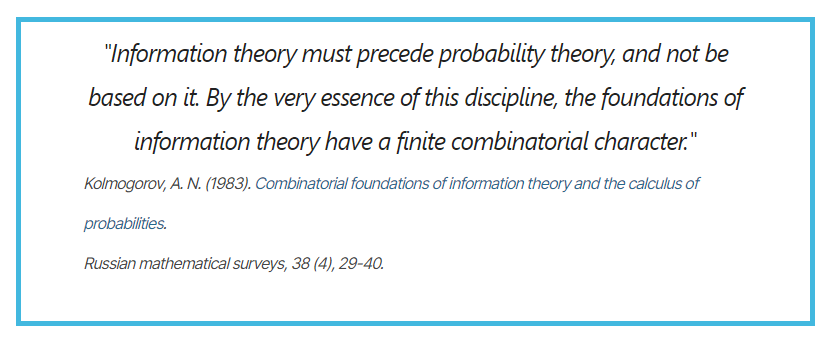

# 算法概率

我们都知道，经典信息论是建立在现代概率论的基础上的。我们使用随机事件产生的概率来度量信息的大小。

但是柯尔莫戈洛夫对此有不同的看法。作为现代概率论公理体系的创建者，他认为信息论应该先于概率论，信息论才是概率论的基础。

在1960年，所罗门诺夫为了发展归纳推理理论，首先定义了柯氏复杂度，随后又在柯氏复杂度的基础上定义了**算法概率**。这是一种利用计算和程序进行定义的概率。70年代，柯尔莫戈洛夫的学生莱文发展了无前缀的柯氏复杂度，并进一步的发掘了算法概率的许多基础性质。

<!-- 这些成果向我们展示了如何站在算法的角度，以信息为媒介去思考概率一词的内涵。 -->

1933年，柯尔莫戈洛夫首次使用测度论的语言严谨的定义了我们现在所使用的概率。当时，他使用三条公理来做定义：
1. 概率是一个非负的实数
2. 整个样本空间中存在一个基本事件发生的概率为1
3. 不相交事件的概率等于不相交事件各自的概率之和（假设有可数个不相交事件）

同样的，通过这三条公理，我们可以定义算法概率。有趣的是，你将会看到算法概率实际上将样本空间限制在了一颗二叉树上。

## 先有信息，后有概率

在第一章中，我们讲述了使用柯氏复杂度来定义信息的方法。

<!-- 
一般来说，定义一个概率需要两个要素：
1.  -->

## 前缀柯氏复杂度

