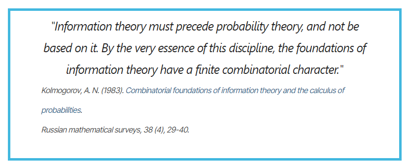

# 算法概率

我们都知道，经典信息论是建立在现代概率论的基础上的。我们使用随机事件产生的概率来度量信息的大小。

但是柯尔莫戈洛夫对此有不同的看法。作为现代概率论公理体系的创建者，他坚定的认为信息论应该先于概率论，信息论才是概率论的基础。

在1960年，所罗门诺夫为了发展归纳推理理论和算法分析，首先定义了柯氏复杂度（其实应该在这里称为所罗门诺夫复杂度），随后又在柯氏复杂度的基础上定义了**算法概率**。

先贤的成果启示我们，站在算法的角度去思考概率一词的内涵，才真正的理解其含义。

## 柏拉图的洞穴寓言

在柏拉图的洞穴寓言中，一些可怜的囚犯从出生开始就锁在一个漆黑的洞穴中。他们所有人都被锁在一面石壁前，不能转头、不能看向对方，也不能看向自己。这个洞穴中还有一群守卫，他们在这些囚犯身后点起了一堆火，囚犯之间是一条高高的带有矮墙的人行道，守卫则在手里拿着“人和其他生物”的物品或木偶在道上行走。

对于这些被锁住的可怜囚犯来说，那些墙上的阴影就是他们的整个世界。他们对于整个世界的认知都来源于这些阴影。

尽管作为生活在现代的自由人，你也许很难想象这些囚犯是如何认知整个世界的。但是如果我说，我们实际上从某种意义上讲也是一群被锁住的囚犯呢？

实际上，当我们观察到某件事情发生时，我们实际上也是在通过火炬在墙上的投影来观察这个世界。因为对于大部分发生在现实世界中的事件，我们仅仅只是观察到了其部分结果，而这些事件背后发生的具体原因对于我们其实是未知的。

我们能否真正的认识到这个世界背后的运行规律？我想这是极为困难的。对于我们来说，万事万物的背后都有无穷的可能性和不确定性。

也正是为了处理这种万事万物的背后的不确定性，我们提出了概率论，我们赋予了每个事件一个概率。在大数定律的规约下，我们可以确信，这些事件的发生符合某些分布。

从这个角度出发，借助柯氏复杂度的概念，我们可以从算法的角度重新审视概率的本质。

## 前缀柯氏复杂度

